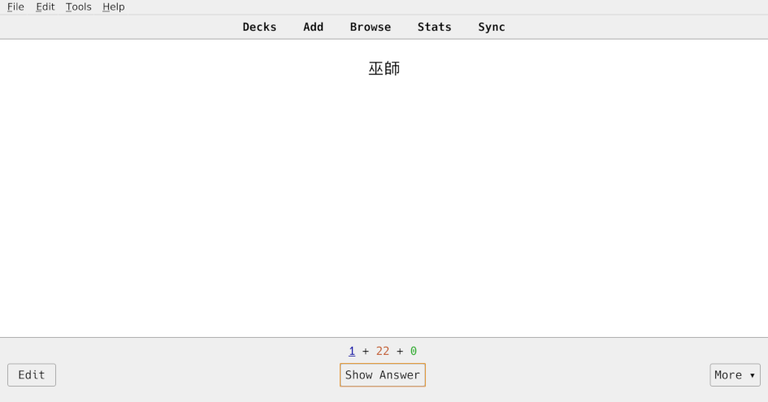
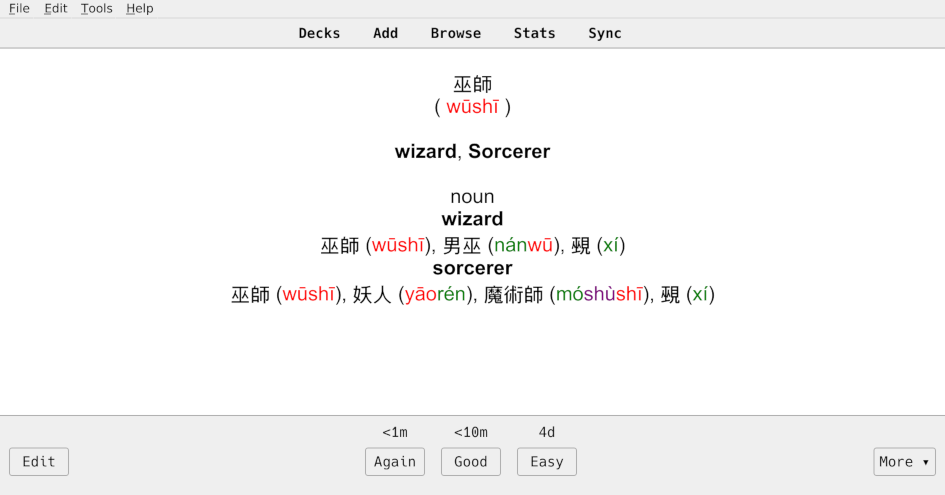

Anki Chinese Vocabulary Deck Builder
====================================

Overview
--------

A simple script to parse a file containing Chinese text and generate
[Anki](https://apps.ankiweb.net/) flashcards from it.





Text is parsed and split into individual words and phrases using the [Stanza NLP package](https://stanfordnlp.github.io/stanza/).
Google translate is then used (via [translate-shell](https://github.com/soimort/translate-shell)) to retrieve translations and
definitions for each separate word/phrase.

These translations are post-processed to include pinyin, and the final results stored in
a tab-delimited file which can be imported by Anki.

This should be useful for parsing things like news articles, blog posts, or even full
books (if you have access to the text for it).

Requirements
------------

- [Python](https://www.python.org/)
- [Translate-shell](https://github.com/soimort/translate-shell)
- [Stanza](https://stanfordnlp.github.io/stanza/)
- [Pandas](https://pandas.pydata.org/)
- [dragonmapper](https://github.com/tsroten/dragonmapper)
- [hanziconv](https://pythonhosted.org/hanziconv/)
- [zhon](https://pypi.org/project/zhon/)

Usage
-----

```
usage: anki-vocab.py [-h] [--append] [--convert]
                     [--format {traditional,simplified}]
                     INFILE OUTFILE
```

E.g.:

```
python anki-vocab.py example/harry_potter_wikipedia.txt example/harry_potter_wikipedia_vocab.txt
```

This will generate a tab-delimited file with four columns:

1. Chinese
2. Pinyin
3. English
4. Definition

You can then import this file into Anki and assign fieldnames to each of the four
columns.

Then, to specify how Anki should display the information on your flash cards, you can
create a new note type which uses the four fields.

For example:

**Front Template**

```
{{ Chinese }}
```

**Back Template**

```
{{ Chinese }}
<br />
( {{ Pinyin }} )
<br />
<br />
{{ English }}
<br />
<br />
{{ Definition }}
```

**Styling**

```
.card {
 font-family: arial;
 font-size: 20px;
 text-align: center;
 color: black;
 background-color: white;
}
.tone1 {
	color: red;
}
.tone2 {
	color: green;
}
.tone3 {
	color: blue;
}
.tone4 {
	color: purple;
}
```

This should result in a format similar to what is shown in the example screenshot above.

Note that pinyin phrases are wrapped in html elements including a class indicating the tone mark
of the character. This way, Anki can be configured to use a different font color for
each different tone, if desired, as shown above.

Limitations
-----------

- Google translate limits users to ~150 API requests every few hours so the script will
  need to pause after each such batch. Progress is save periodically to avoid having to
  re-query many words if the script is stopped mid-way.
- I am currently using the script to translate traditional chinese (繁體字). The script has
  generally been written in such a way that it can be easily extended to support
  simplified chinese parsing, but a little bit of work would need to be done first.
- The list of "common words" that are filtered out 

Development
-----------

I probably won't have time to work on this much, but feel free to submit pull requests
with bug fixes or improvements.

As mentioned above, steps were taken to begin to support simplified chinese as well, but
I have not thoroughly tested that functionality and it likely needs a little more work
to get working.

